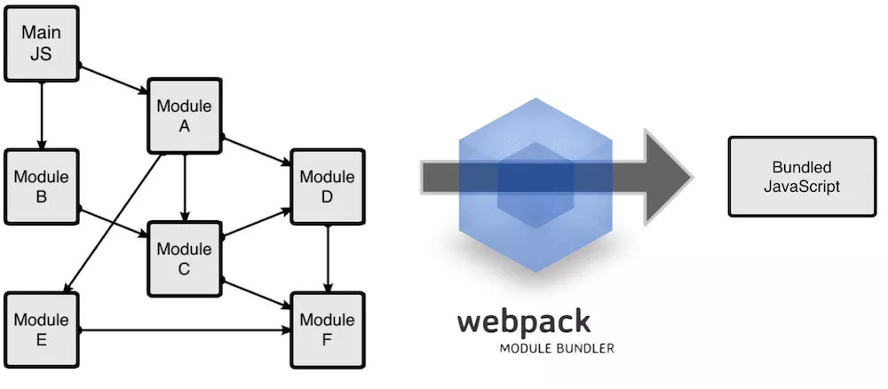

# Webpack

[TOC]

## 了解Webpack

### 什么是webpack

WebPack可以看做是模块打包机：它做的事情是，分析你的项目结构，找到JavaScript模块以及其它的一些浏览器不能直接运行的拓展语言（Scss，TypeScript等），并将其转换和打包为合适的格式供浏览器使用。


### 为什要使用webpack

* 模块化开发：让我们可以把复杂的程序细化为小的文件;
* ES6转ES5：让我们能够使用JavaScript的新特性，并且能转换成浏览器可以识别的版本
* 预处理：Scss，less等CSS预处理器
* 预编译：vue单文件组件编译
* ...

### webpack与gulp的区别

* gulp工作流程
> Gulp的工作方式是：在一个配置文件中，指明对某些文件进行类似编译，组合，压缩等任务的具体步骤，工具之后可以自动替你完成这些任务


* webpack工作流程
>Webpack的工作方式是：把你的项目当做一个整体，通过一个给定的主文件（如：index.js），Webpack将从这个文件开始找到你的项目的所有依赖文件，使用loaders处理它们，最后打包为一个（或多个）浏览器可识别的JavaScript文件。


## 使用webpack

### 安装

```
    //全局安装
    npm install -g webpack
    //安装到你的项目目录
    npm install --save-dev webpack
```

### 配置文件

> 在根目录创建webpack.config.js文件，并写入如下配置信息

* entry: 入口文件
* output: 输出设置
    * path: 打包后的文件存放的路径
    * filename: 打包后输出的文件名
        * `[name]`：以入口名作为文件名
        * `[hash]`：添加hash值
    * publicPath: 打包后index.html代码中文件引用前缀（如：src,href等）
    >一般用于打包后图片等资源文件的路径问题

    ```javascript
        module.exports = {
            //__dirname是一个nodejs的global变量，指代当前执行文件所在的文件夹
            entry:  __dirname + "/app/main.js",//唯一入口文件
            output: {
                path: __dirname + "/public/js",//打包后的文件存放的路径
                filename: "bundle.js"//打包后输出的文件名
            }
        }
    ```

* devServer：测试服务器
    > 配合webpack-dev-server插件使用，webpack development server 是一个webpack可选的本地开发的server。它通过nodejs的express 来起一个server提供静态文件服务，同时它根据配置信息（webpack.config.js）来打包资源，**存在内存中**，同时当你的代码发生改变的时候，它还可以刷新你的浏览器。它是一个单独的npm module，通过npm install webpack-dev-server --save-dev来给项目安装依赖。

    * contentBase： 服务器路径（默认：项目的根目录）
    * port: 指定端口（默认：8080）
    * inline: 是否自动刷新（默认：true）
    * open: 是否自动打开浏览器（默认：false）
    * historyApiFallback: 对于单页面程序，浏览器的histroy可以设置成html5 history api或者hash
    * proxy: 服务器代理（一般用于解决ajax跨域问题）
        > webpack-dev-server的实现方法其实是对http-proxy-middleware的封装

    ```js
        proxy:{
            "/api":{
                target:"http://api.douban.com/v2/movie",//代理目标服务器
                changeOrigin: true,
                pathRewrite: {'^/api' : ''}, //替换部分路径
            }
        }
    ```
* mode：模式
    - production（默认）
    - development
    - none
* module
  - rules: 配置Loader（加载器）规则（[详情](#Loader（加载器）)）
* plugin:插件（[详情](#Plugins（插件）)）
* resolve
    * alias     别名
    * mainFields 优先采用package.json中哪份代码
    * extensions 默认扩展名

    ```js
        resolve: {
            alias: {
                'vue$' : 'vue/dist/vue.js',
                '@':path.resolve('src')
            },
            mainFields: ['browser', 'main'],
            extensions:['.js', '.json']
        }
    ```
      

### 运行

* 写好配置文件后，在终端里运行命令进行打包操作
  - webpack：输出打包后的文件（需全局安装webpack）
  - webpack-dev-server：不输出文件，运行静态服务器（默认8080端口，需全局安装webpack-dev-server）
* 任务快捷命令
    > 在package.json中设置快捷方式，命令行运行格式：npm run 快捷命令

```json
  "scripts": {
    "dev":"webpack-dev-server  --inline --progress",
    "start":"npm run dev",
    "build":"webpack --progess"
  }
```


## Loader（加载器）

> Webpack有一个不可不说的优点，它把所有的文件都都当做模块处理，webpack通过loader来加载各种各样的资源（如css,sass,less,vue文件组件,图片等），不同的资源应用的不同的loader，loaders是通过单独的npm来安装的，然后在webpack.config.js中通过module.rules来配置。loader的配置包括

* module.rules(Array)
    - test：一个用以匹配loaders所处理文件的拓展名的正则表达式（必须）
    - use(Object|Array)
        * loader(String)：loader的名称
        * options(Object):配置loader参数
    - loader(String|Array)
    >PS：loader为use.loader的简写，可以支持多个loader(处理顺序从后往前)
    - include/exclude:手动添加必须处理的文件（文件夹）或屏蔽不需要处理的文件（文件夹）（可选）；
    - query：为loaders提供额外的设置选项（可选）

### babel-loader

> Babel其实是一个编译JavaScript的平台，它可以编译代码帮你达到以下目的：

* balel能做什么
  - ES6、ES7...转ES5
  - 让你能使用基于JavaScript进行了拓展的语言，比如React的JSX；
* babel-loader依赖模块
  * babel-core: 核心功能
  * babel-preset-env：解析标准化的ES语法
  * babel-plugin-transform-runtime：解析未标准化的ES语法（如：async,await）
  * babel-preset-react: 解析JSX

  >注意babel-loader与babel-core的版本问题

### css-loader

> 作用是让webpack可以解析执行css文件

* style-loader：作用是生成一个style标签，并且将解析后的css文件插入到style中去
>css-loader使你能够使用类似@import 和 url(...)的方法实现 require()的功能, style-loader将所有的计算后的样式加入页面中，二者组合在一起使你能够把样式表嵌入webpack打包后的JS文件中
* sass-loader：编译sass文件
    * 依赖node-sass模块

### vue-loader

> 编译vue代码

* vue-template-compiler：解析vue单文件模板

### url-loader

> 一个对图片等文件进行优化的加载器，可以解决图片引用路径的问题，并可以根据limit设置把小图片一dataURI的方式保存，减少http请求
* limit: 文件大小
    - 小于等于limit，则以dataURI方式显示
    - 大于limit，则调用file-loader处理
* name：文件名规则
    - 默认值：文件哈希。
    - `[path]`表示输出文件的相对路径与当前文件相对路径相同，打包后文件中引用文件的路径也会加上这个相对路径
    - `[name].[ext]`则表示输出文件的名字和扩展名与当前相同

* file-loader：解决图片引用路径的问题（img和background）
> url-loader内置file-loader的功能

```js
    {
        test: /\.(png|jpe?g|gif|svg)(\?.*)?$/,
        loader: 'url-loader',
        options: {
          limit: 10000,
          name: 'img/[name].[hash:7].[ext]'
        }
    }
```


## Plugins（插件）

> loader 被用于转换某些类型的模块，而插件则可以用于执行范围更广的任务，可以处理loader处理不了的事情。插件的范围包括：打包优化、资源管理和注入环境变量。

### HtmlWebpackPlugin

这个插件的作用是依据一个html文件作为模板模板，在出口目录自动生成一个引用你打包后的JS的新文件（生成多个页面要多次调用new HtmlWebpackPlugin()）

* template:模板路径
* filename:输出文件名（默认：index.html）
* title:设置html文件的title属性
    > 在模板title标签中写入`<%= htmlWebpackPlugin.options.title %>`
* hash:是否自动往引入的css或js中添加hash（默认：false）
* chunks：提取公共部分文件

```javascript
  plugins:[
    new HtmlWebpackPlugin({
      template:'./src/index.html'
    })
  ]
```

### clean-webpack-plugin

添加了hash之后，会导致改变文件内容后重新打包时，文件名不同而内容越来越多，因此这里介绍另外一个很好用的插件clean-webpack-plugin
```javascript
    plugins:[
        new CleanWebpackPlugin('dist')//参数：String/Array
    ]
```

### extract-text-webpack-plugin

用于提取css文件的公共部分，从一个已存在的 loader 中，创建一个提取(extract) loader
* 参数（String|Object）
    - filename

```javascript
    plugins:[
        new ExtractTextWebpackPlugin('common.css')//参数：String/Object
    ],
    rules:[
        { 
            test: /\.css$/, 
            use: ExtractTextWebpackPlugin.extract({
                use: 'css-loader',
                fallback:'style-loader'
            }) 
        }
    ]
```
>PS：由于本插件还未支持webpack4，可能会报错，安装时请使用npm install -D extract-text-webpack-plugin@next（@4.0.0-beta.0）

### copy-webpack-plugin

在webpack中拷贝文件和文件夹，一般用于把资源文件（图片等）拷贝到编译目录

* from    定义要拷贝的源目录
* to      定义要拷贝到的目标目录（基于output目录）

### webpack自带插件

#### Hot Module Replacement

是webpack自带很有用的一个插件，它允许你在修改组件代码后，自动刷新实时预览修改后的效果

* 在webpack配置文件中添加HMR插件；
```javascript
  plugins:[
      new webpack.HotModuleReplacementPlugin()
  ]
```
>PS: webpack-dev-server内部自动调用HotModuleReplacementPlugin，使用webpack-dev-server时不需要额外配置HMR

#### webpack.optimize.CommonsChunkPlugin 

它用于提取多个入口文件的公共脚本部分，然后生成一个 common.js 来方便多页面之间进行复用（webpack4已被移除）。
```javascript
    plugins:[
        new webpack.optimize.CommonsChunkPlugin({
          names: ['vendor']
        })
    ]
```

#### webpack.ProvidePlugin

import引入模块后，无论你在代码中是否使用该模块，打包时都会打包进去，这样就会产生大量的冗余js，ProvidePlugin只有你在使用到此库的时候，才会打包进去
```javascript
    plugins:[
        //利用ProvidePlugin提供jquery模块，可以在任意代码中直接使用$,jQuery
        new webpack.ProvidePlugin({
            $:'jquery',
            jQuery: 'jquery',
            'window.jQuery':'jquery'
        })
    ]
```
